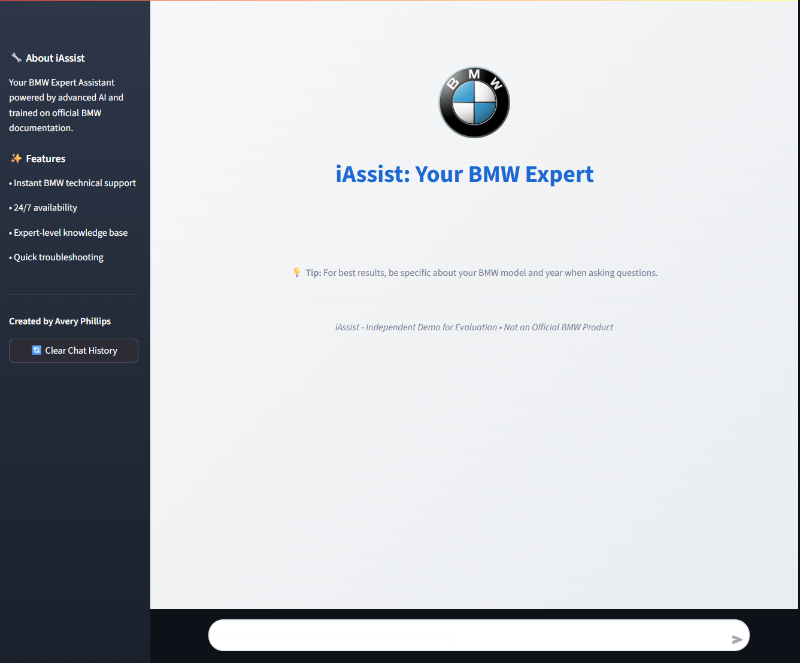
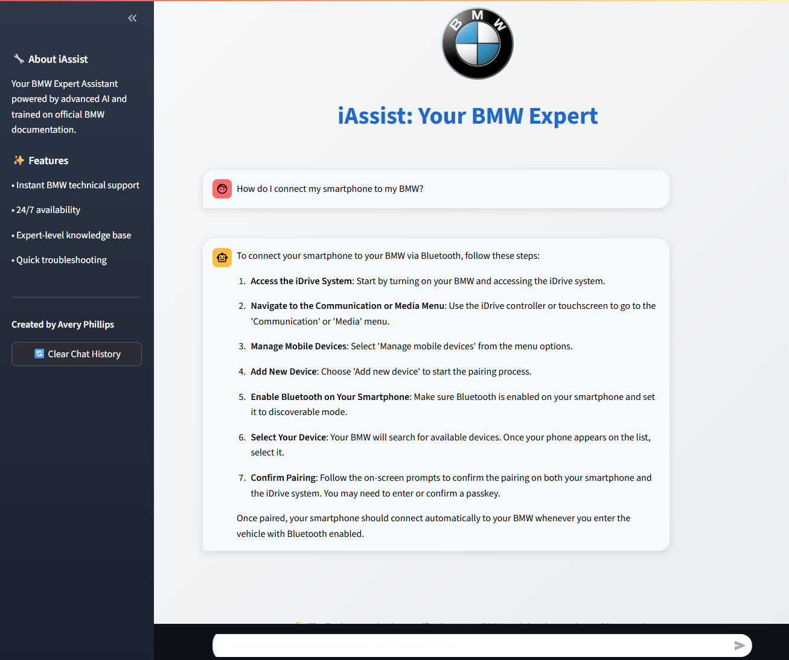

# iAssist: Your BMW Expert Chatbot 🚗

iAssist is an AI-powered virtual BMW Product Specialist and Genius, designed to provide clear, concise, and accurate information about BMW features, services, and troubleshooting. It leverages a specialized knowledge base to offer expert-level assistance on topics like iDrive 8, Parking Assistant Professional, BMW ConnectedDrive services, electric vehicle charging for BMW iX, and Head-up Display.

This project demonstrates how to build an intelligent chatbot using Streamlit for the user interface and OpenAI's GPT-4o for natural language understanding and generation, augmented with a custom knowledge base (FAQs).

## Screenshots

**iAssist Welcome Screen**


**Chatbot Interaction (Question & Answer)**



## Features

* **Expert Knowledge Base:** Trained on specific BMW feature details and common service advisor FAQs. **(Note: The current knowledge base contains a limited set of approximately 10 FAQs for demonstration purposes.)**
* **Instant Answers:** Provides quick and accurate responses to user queries.
* **User-Friendly Interface:** Built with Streamlit for an intuitive chat experience.
* **Context-Aware:** Prioritizes information from the provided BMW knowledge base.

## Technologies Used

* **Python:** The core programming language.
* **Streamlit:** For building the interactive web application interface.
* **OpenAI GPT-4o:** Powers the conversational AI capabilities.
* **JSON:** Used to store the structured knowledge base (FAQs).

## Setup and Local Installation

To run iAssist locally or in an environment like Replit, follow these steps:

1.  **Clone the repository:**
    ```bash
    git clone [https://github.com/avery-phillips/iAssist-BMW-Chatbot.git](https://github.com/avery-phillips/iAssist-BMW-Chatbot.git)
    cd iAssist-BMW-Chatbot
    ```
    *(Note: Replace `avery-phillips` with your actual GitHub username if different)*

2.  **Set up OpenAI API Key:**
    You will need an OpenAI API key. Store it as an environment variable named `OPENAI_API_KEY`.
    * **For Replit:** Go to the "Secrets" tab (lock icon) in your Replit project and add a new secret:
        * Key: `OPENAI_API_KEY`
        * Value: `your_openai_api_key_here` (replace with your actual key)
    * **For local development:** Create a `.env` file in your project root and add `OPENAI_API_KEY="your_openai_api_key_here"`, then load it using a library like `python-dotenv`. Alternatively, set it directly in your shell: `export OPENAI_API_KEY="your_openai_api_key_here"`.

3.  **Install Dependencies:**
    Make sure you have `pip` installed, then install the required Python packages:
    ```bash
    pip install -r requirements.txt
    ```

4.  **Prepare Knowledge Base:**
    Ensure `manual_faqs.json` is in the root directory of the project. This file contains the FAQ data that the chatbot uses as context.

5.  **Run the Streamlit Application:**
    ```bash
    streamlit run main.py
    ```
    This command will start the Streamlit server, and your chatbot will be accessible in your web browser, typically at `http://localhost:8501`.

## Project Structure